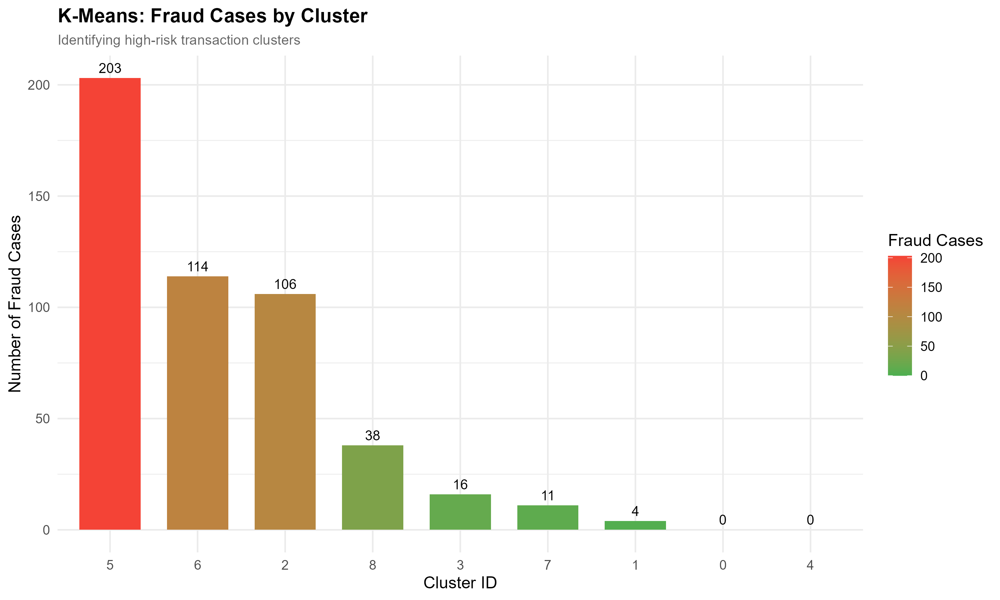
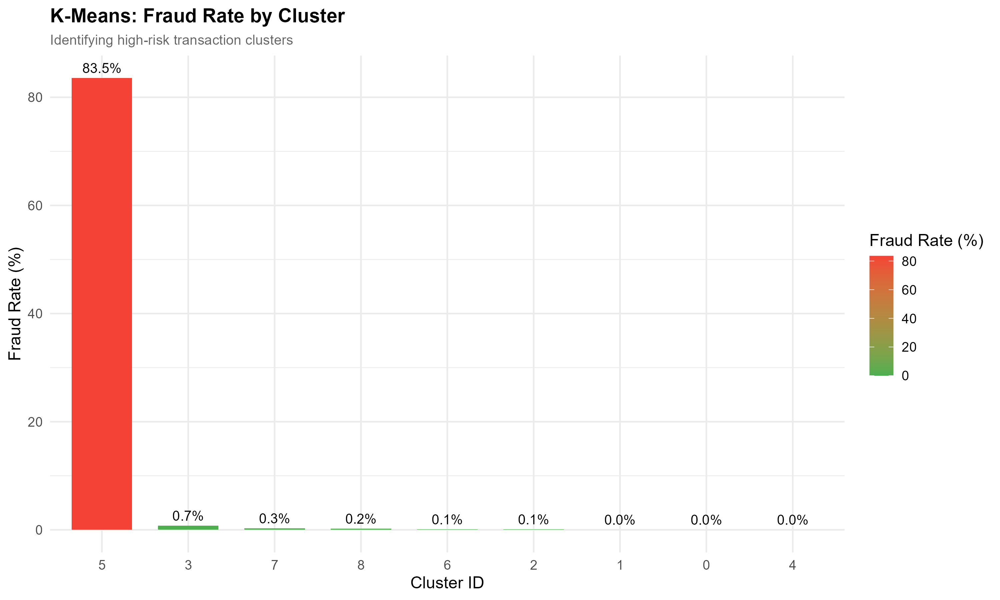
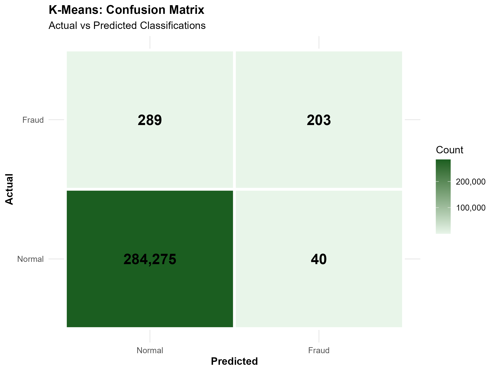

Fraud detection unter Verwendung von Spark.  
Hierfür wird ein einfaches k-means Clustering und SVM implementiert.  
Als Datenset wird das häufig verwendete creditcard fraud dataset verwendet, welches auf kaggle heruntergeladen werden kann.  
Graphiken erstellt mit R.  

Das Datenset besteht aus 284.607 Einträgen. Davon sind 492 Fraud:  
<pre>
+-----+------+  
|Class| count|  
+-----+------+  
|    1|   492|  
|    0|284315|  
+-----+------+  
</pre>

# K-Means Clustering
Für dieses Clustering werden alle Datenpunkte verwendet.  
Durch kleinere Tests wird eine effiziente Anzahl an k-Cluster geschätzt, mit dem Ziel die als Fraud-klassifizierten Datenpunkte in seperate Cluster zu unterteilen.
In diesesm Fall mit k = 9 können die Fraud-Datenpunkte wie folgt aufgeteilt werden:  

Wie zu sehen ist konnten die 492 Fraud größtenteils auf wenige Cluster aufgeteilt werden.  
Betrachten wir nun die Verteilung von Fraud innerhalb dieser Cluster, ist leicht zu sehen, dass Cluster 5 fasst nur aus Fraud besteht:  

Somit kann Cluster 5 als vorhersage für Fraud verwendet werden, welches zu folgenden Metriken führt:  

<pre>
Accuracy:  0.9988
Precision: 0.8354
Recall:    0.4126
F1-Score:  0.5524
</pre>

Etwa 41% aller Fraud-Cases werden somit korrekt erkannt, wobei 15% falsch als Fraud erkannt werden.

# SVM

|WIP|
